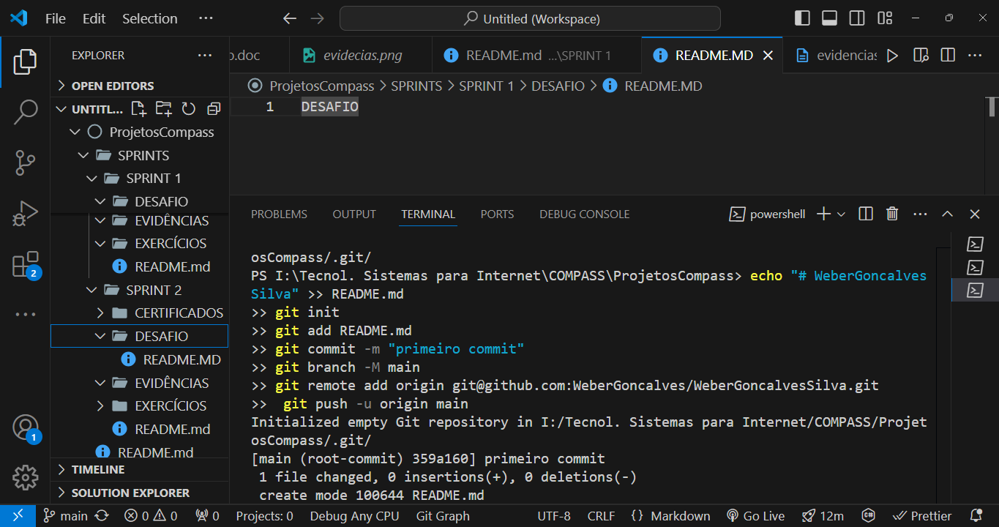
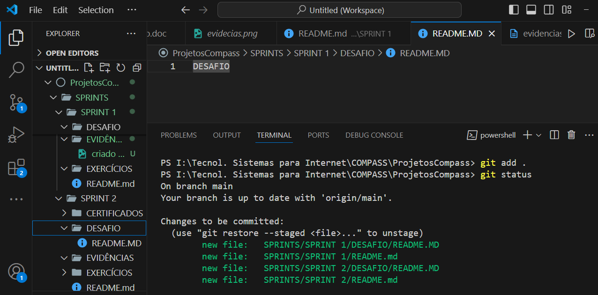
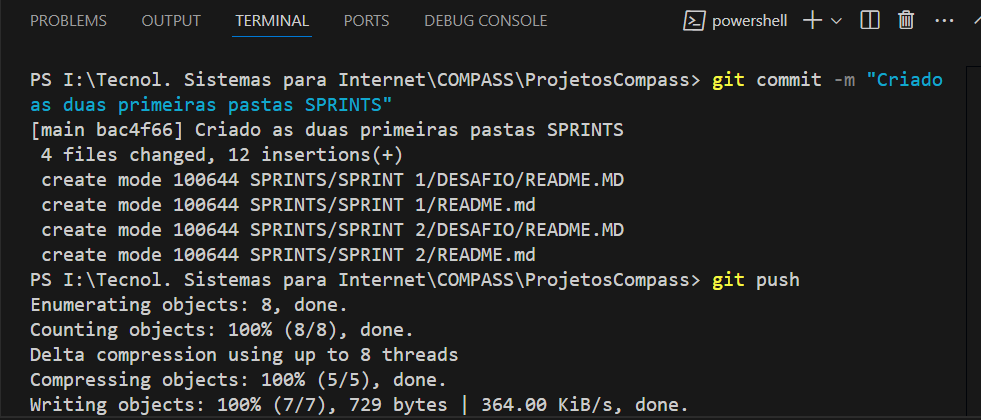
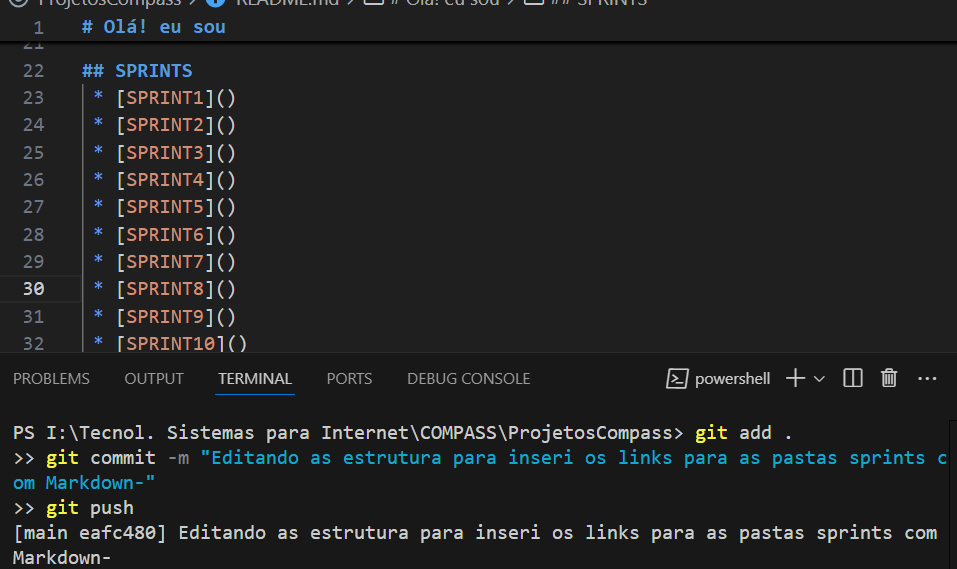
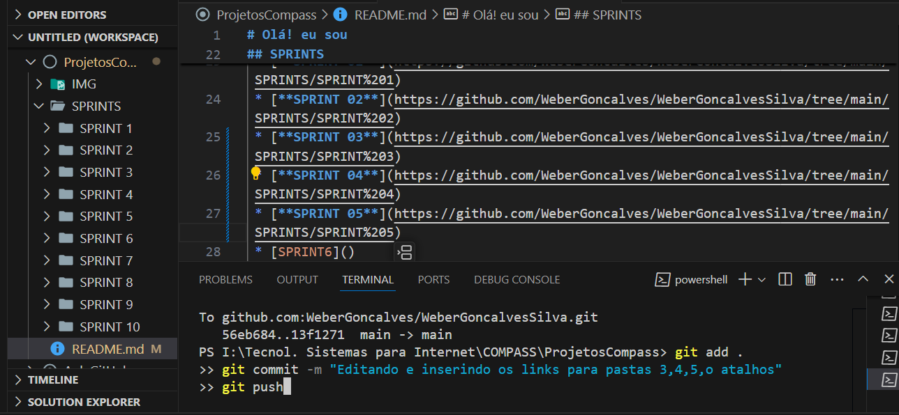
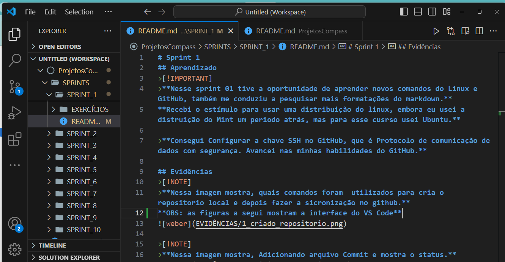

# Sprint 1
## Aprendizado
>[!IMPORTANT]
>**Nesse sprint 01 tive a oportunidade de aprender novos comandos do Linux e GitHub, também me conduziu a pesquisar mais formatações do markdown.**
**Recebi o estímulo para usar uma distribuição do linux, embora eu usei a distruição do Mint um periodo atrás, mas para esse cusrso usei Ubuntu.**  

>**Consegui Configurar a chave SSH no GitHub, que é Protocolo de comunicação de dados com segurança. Avancei nas minhas habilidades do GitHub.**

## Evidências
>[!NOTE]
>**Nessa imagem mostra, quais comandos foram  utilizados para cria o repositorio local e depois fazer a sicronização no github.**
**OBS: as figuras a segui mostram a interface do VS Code**

>[!NOTE]
>**Nessa imagem mostra, Adicionando arquivo Commit e mostra o status.**

>[!NOTE]
>**Adicionando arquivo Commit com mensagem explicando a modificação e o push para sincronizar com repositorio github.**

>[!NOTE]
>**Aqui mostra a primeira etapa da criação da estruturas de pasta SPRINTS.**

>[!NOTE]
>**Formatação dos nomes das pastas SPRINTS, e a inserção dos links.**

>[!NOTE]
>**Edição e Formatação da readme do sprint 01 inserção das figuras.**

